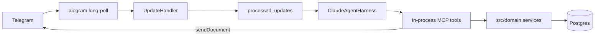

# Kiranawala

**Bot: [@Kiranawala_bot](https://t.me/Kiranawala_bot)**  
**Demo video:** [Google Drive](https://drive.google.com/file/d/1eosIJEk_uvob3psICtItBrQIfbZTtL1U/view?usp=sharing)

Telegram is the only UI. An Indian kirana owner stocks shelves, builds GST bills,
runs khata, and pulls PDF invoices / PPTX decks by chatting in plain language —
no admin site, no CRUD screens.

Domain terms: [`CONTEXT.md`](CONTEXT.md). Decisions: [`docs/adr/`](docs/adr/).

---

## Contents

- [Shape of the system](#shape-of-the-system)
- [Why this harness](#why-this-harness)
- [Message path](#message-path)
- [Skills, tools, and where rules live](#skills-tools-and-where-rules-live)
- [Nine hard problems](#nine-hard-problems)
- [Domain vocabulary](#domain-vocabulary)
- [Owner capabilities](#owner-capabilities)
- [Run it](#run-it)
- [Walkthrough](#walkthrough)
- [Stretch](#stretch)
- [Gaps and next hardening](#gaps-and-next-hardening)

---

## Shape of the system



Chat text (or Whisper transcript / photo) enters one handler. The model composes
small tools. Money, stock, and GST change only inside domain services against
Postgres — never from free-text invention in the prompt.

---

## Why this harness

Stack: **Claude Agent SDK (Python)** — `query()` plus in-process MCP `tool()`
servers.

- Multi-tool turns are native (`find_product` → `add_line` → `view_draft` →
  `finalize_bill`) without a hand-rolled router or LangGraph-style graph.
  That matches the brief’s agent loop and avoids a keyword dispatcher.
- Skill playbooks (`docs/agents/*.md`) sit in the system prompt; tool schemas
  stay first-class; enforcement stays in Python services.
- Required artifacts land cleanly in Python: **WeasyPrint** invoices and
  **python-pptx** decks with real charts.

Skipped for this take-home: Vercel AI SDK / Next.js (weaker PDF–PPTX fit here),
heavy deep-agent frameworks (overkill for one shop), and any regex intent layer.

Default model: `claude-sonnet-5` via `CLAUDE_MODEL_ID`. Voice uses a hosted
Whisper HTTP API (`WHISPER_API_KEY`). Change the Claude model in env; tools and
harness stay put.

---

## Message path

1. `src/main.py` long-polls Telegram (aiogram). Startup clears any webhook so
   polling owns delivery — no public HTTPS URL required for the core path.
2. `UpdateHandler.handle` (`src/bot/handler.py`) takes every update.
3. **Claim first:** `ProcessedUpdatesStore.try_record(update_id)`. Duplicate
   `update_id` → stop; no agent turn ([ADR-0004](docs/adr/0004-idempotency-two-layers.md)).
4. `/new` clears only the in-process Claude session id for that chat. Preferences
   and Shop Profile stay ([ADR-0007](docs/adr/0007-cross-session-memory.md),
   [ADR-0009](docs/adr/0009-ephemeral-sessions-durable-store.md)).
5. Voice → Whisper transcript; photo → download + optional multimodal prompt.
   Bad transcription gets a fixed apology — still no intent router.
6. `ClaudeAgentHarness.reply` (`src/agent/harness.py`) injects standing memory
   (Preferences + Shop Profile), resumes the chat’s session when present, and
   runs `query()` with the full MCP allowlist.
7. The model loops observe → tool → result → reply. Document tools call
   Telegram `sendDocument` themselves for PDF / PPTX.

Beyond `/new`, the harness does not branch on message text. Owner wording goes
straight to the model.

---

## Skills, tools, and where rules live

| Layer | Role |
| ----- | ---- |
| `docs/agents/*.md` | How to compose tools (inventory, billing, khata, analytics, documents, preferences) |
| `src/tools/*_tools.py` | Thin MCP adapters: session → domain → JSON (`ok` / `refused` / `requires_confirmation`) |
| `src/domain/*` | Business rules, locks, GST, stock |
| `src/tools/mcp_server.py` | Server wiring + allowlist |

GST math has one home: `src/domain/pricing.py` (integer paise).

| Domain | Path | Tools |
| ------ | ---- | ----- |
| Inventory | `inventory_tools` → `inventory`, `barcode` | `find_product`, `scan_barcode`, `prepare_photo_product`, `add_product`, `receive_stock`, `get_stock`, `list_low_stock`, `list_expiring_soon` |
| Billing | `billing_tools` → `billing`, `pricing` | `open_draft_bill`, `add_line`, `update_line`, `remove_line`, `view_draft`, `finalize_bill` |
| Khata | `khata_tools` → `khata` | `find_or_create_customer`, `add_khata_charge`, `record_payment`, `get_khata_balance` |
| Analytics | `analytics_tools` → `analytics` | `daily_close`, `weekly_sales_report`, `reorder_suggestions` |
| Documents | `documents_tools` → `invoice`, `analysis_deck` | `set_shop_profile`, `get_shop_profile`, `find_bill`, `send_invoice_pdf`, `send_analysis_deck` |
| Preferences | `preferences_tools` → `preferences` | `set_preference`, `get_preferences` |

No “run the whole store” mega-tool — the model chains these.

---

## Nine hard problems

1. **Grounding** — Money-touching tools take `product_id`, not a name string
   ([ADR-0008](docs/adr/0008-structural-grounding-product-id.md)). Resolve via
   `find_product` (pg_trgm + aliases), `scan_barcode`, or photo confirm.
   MRP / slab / HSN come from the Product row at finalize.

2. **Oversell** — Soft warning on `add_line` is advisory. Authoritative check
   is in `finalize_bill` after ordered locks: sellable = non-expired batch qty;
   refuse `oversell` ([ADR-0003](docs/adr/0003-drafts-persisted-no-reservation.md)).
   Drafts never reserve stock.

3. **GST** — `pricing.py` peels tax-inclusive MRP, splits CGST/SGST, half-up
   paise, bill round-off ([ADR-0006](docs/adr/0006-mrp-tax-inclusive-integer-paise.md)).
   The PDF prints stored bill figures; it does not recompute tax.

4. **Multi-turn bills** — Open Draft Bill + lines live in Postgres by `chat_id`.
   Edits span messages; quantity on Product / batches moves only at finalize.

5. **Idempotency** — Transport: unique `update_id` before the agent.
   Domain: finalize under draft lock; already-finalized → same bill,
   `idempotent_replay=True` ([ADR-0004](docs/adr/0004-idempotency-two-layers.md)).

6. **Concurrency** — Stock paths `SELECT … FOR UPDATE` products/batches in
   sorted id order, then append `stock_ledger`
   ([ADR-0005](docs/adr/0005-concurrency-locking-and-stock-ledger.md)). Covered
   by concurrent finalize tests in billing / FEFO suites.

7. **Guardrails** — Below-cost finalize, new-customer create, khata overpay,
   and photo vision (`prepare_photo_product`) use confirmation / refuse in
   domain code. No delete-stock tool.

8. **Artifacts** — Jinja `templates/invoice.html` → WeasyPrint PDF; analysis
   deck → python-pptx with native charts — not screenshots or pasted prose.

9. **Cross-session memory** — Preferences + Shop Profile keyed by owner
   Telegram id, injected every turn (`render_standing_memory`). `/new` drops
   only the Claude session id; UPI default, preferred atta, GSTIN, schedules
   remain ([ADR-0007](docs/adr/0007-cross-session-memory.md)).

---

## Domain vocabulary

Kirana-shaped, not a generic catalog (full glossary in `CONTEXT.md`):

- **Money** — ₹ as integer **paise** only.
- **Product** — cost, tax-inclusive MRP, qty, reorder level, GST slab, HSN;
  packaged vs loose.
- **Draft Bill / Bill** — editable draft holds no stock; finalize mints Bill,
  decrements batches, assigns invoice number.
- **Line** — grounded `product_id` + qty + derived tax.
- **GST** — slabs 0 / 5 / 12 / 18; CGST+SGST; no blended % invention.
- **Payment** — cash / UPI / card / **khata** at finalize
  ([ADR-0011](docs/adr/0011-khata-as-payment-mode.md)).
- **Khata** — Customer + append-only entries; balance = sum of charges − payments.
- **Batches / FEFO** — `stock_batches` with optional expiry; earliest expiry
  first ([ADR-0012](docs/adr/0012-fefo-batch-tracking.md)).
- **Standing memory** — Preferences + Shop Profile outside chat history.

---

## Owner capabilities

Composed by the model — not slash-commands (except `/new`).

| Need | Example | Tools |
| ---- | ------- | ----- |
| Stock-in | “50 Maggi in, cost ₹12” | `find_product` → `receive_stock` |
| New SKU | “Amul Butter 100g, GST 12%, MRP ₹62” | `add_product` |
| Bill | “2kg sugar, 1 Aashirvaad 5kg, 4 Maggi, UPI” | draft → `add_line` ×N → `finalize_bill` |
| Edit draft | “drop butter, make Maggi 6” | `remove_line` / `update_line` |
| Stock left | “how much sugar?” | `find_product` → `get_stock` |
| Low / reorder | “what’s running out?” | `list_low_stock`, `reorder_suggestions` |
| Khata | “₹500 on Ramesh” / “paid ₹300” / “balance?” | customer + charge / pay / balance |
| Day close | “today’s sales?” | `daily_close` |
| Invoice | “send that bill as PDF” | `find_bill` → `send_invoice_pdf` |
| Deck | “this week’s analysis deck” | `send_analysis_deck` |
| Defaults | “always assume UPI” | `set_preference` |
| Shop / logo | “shop name…, GSTIN…, logo https://…” | `set_shop_profile` |

Ambiguous names (e.g. two “atta” products) → clarify from `find_product`
`ambiguous` results, not a handler branch.

---

## Run it

**Need:** Docker Compose, [@BotFather](https://t.me/BotFather) token, Anthropic
key, Whisper-compatible API key.

```bash
cp .env.example .env
# TELEGRAM_BOT_TOKEN, ANTHROPIC_API_KEY, WHISPER_API_KEY

docker compose up --build
```

Migrations run on boot; APScheduler starts for weekly deck / khata digests.
Message [@Kiranawala_bot](https://t.me/Kiranawala_bot) while the stack is up.

Local checks:

```bash
uv sync --group dev
uv run ruff check .
uv run mypy src
uv run pytest
```

---

## Walkthrough

Recorded walkthrough: [demo video](https://drive.google.com/file/d/1eosIJEk_uvob3psICtItBrQIfbZTtL1U/view?usp=sharing).

Useful order for a live demo:

1. Receive stock for a few products.
2. Build a multi-line bill over several messages; edit mid-draft.
3. Oversell — expect a tool-layer refuse.
4. Khata: charge → balance → payment.
5. PDF invoice for a finalized bill.
6. Weekly PPTX analysis deck.
7. Set a preference, `/new`, show the preference still applies.

---

## Stretch

All eight brief §7 stretches are implemented (not stubs):

| Stretch | Where it lives |
| ------- | -------------- |
| Branded invoice PDF | Shop Profile logo / accent + WeasyPrint template |
| Scheduled weekly deck | In-process APScheduler ([ADR-0013](docs/adr/0013-in-process-scheduler.md)) |
| Velocity reorder | `reorder_suggestions` |
| FEFO batches | `stock_batches` + finalize consumption ([ADR-0012](docs/adr/0012-fefo-batch-tracking.md)) |
| Voice orders | Whisper → same harness ([ADR-0014](docs/adr/0014-voice-transcription-and-resource-budget.md)) |
| Hindi / Tamil | Aliases + prompt mirror ([ADR-0016](docs/adr/0016-multilingual-scope.md)) |
| Barcode / photo ID | pyzbar + vision confirm gate ([ADR-0015](docs/adr/0015-image-input-barcode-and-vision.md)) |
| Khata reminders | Owner-only digest on preference schedule |

---

## Gaps and next hardening

- **Session ids** are in-process — restart drops Claude continuity; drafts,
  stock, khata, and Preferences in Postgres survive (`view_draft` recovers
  open drafts).
- **Scheduler** is in-process; a downtime window can miss a firing — owner can
  still request a deck on demand.
- **One shop / one owner** by design for this brief.
- **PPTX + native script** is weaker than invoice Noto embedding; decks stay
  label-light for non-Latin.
- **Draft summaries** in chat are model prose over structured tool JSON, not a
  fixed Telegram table UI.

Further hardening (distributed cron, fully localized GST invoices, multi-tenant
shops) is outside v1.
